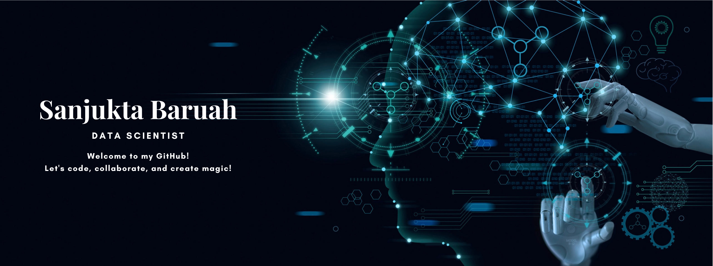

<!-- ### Hi there 👋, I am Sanjukta Baruah.

I'm a passionate Data Science grad with a strong cloud engineering background. Excited about data-driven insights and automation. Proficient in Python, R, Azure, and various ML frameworks. Skilled in regression, classification, clustering, and more. Let's collaborate on innovative projects and drive positive impact! 💻🚀 Open to learning and always eager to explore new technologies and methodologies. Connect with me to geek out on data science and build awesome solutions together! 😄📊

### Skills
#### Language:

 

#### Toolkits and frameworks:

### Platforms:

 

#### Coding Environments:

 

#

 
<h3> My full introduction </h3>

    I'm a passionate Data Science graduate (May 2024) with an MSc in Data Science from State University of New York at Buffalo and a BTech in Electronics and Communication Engineering from DUIET, Dibrugarh University. With a strong background in cloud engineering and a keen eye for data-driven insights, I excel at automating processes, optimizing infrastructure, and ensuring ISO27001:2013 compliance. As a former Cloud Engineer at Cognizant, I specialized in implementing strategic plans for infrastructure improvement, reducing manual effort, and fostering team collaboration through knowledge-sharing sessions.

    My internships at Kaliber Labs Inc. and KOViD Analytics allowed me to delve into speech recognition and English Digit recognition systems, utilizing HMM and machine learning classifiers. My proficiency in Python, R, and various toolkits like Pandas, NumPy, Matplotlib, and Scikit-Learn enables me to excel in regression, classification, ensemble learning, clustering, PCA, and neural networks. Additionally, I'm well-versed in various technologies, including Azure, MySQL, PostgreSQL, Spark, Hadoop, PowerBI, Tableau, Excel, VBA, and more.

    I hold certifications in Azure AI Fundamentals (AI900), Azure Administrator (Az104), and Designing and Implementing a Data Science Solution on Azure (DP-100), and I'm excited to apply my diverse skill set to meaningful data science projects. Let's connect and collaborate to drive innovation and make a positive impact together!

    
<!--Source: (https://github.com/anuraghazra/github-readme-stats)-->

<!--
**Sanjukta2212** is a ✨ _special_ ✨ repository because its `README.md` (this file) appears on your GitHub profile.

Here are some ideas to get you started:

- 🔭 I’m currently working on ...
- 🌱 I’m currently learning ...
- 👯 I’m looking to collaborate on ...
- 🤔 I’m looking for help with ...
- 💬 Ask me about ...
- 📫 How to reach me: ...
- 😄 Pronouns: ...
- ⚡ Fun fact: ...
-->
<!-- Sanjukta_README.md
Displaying Sanjukta_README.md. -->

## About me
- Final year Data Science grad at State University of New York at Buffalo 🎓
  
- 3+ years professional experience as a cloud engineer specialized in Azure at a Fortune 500 company 💼
  
- Passionate about data-driven insights and automation 🔍
  
- Proficient in Python, R, Azure, Big Data, and ML frameworks 🐍📊    
  
- Open to collaborating on innovative projects for positive impact 🚀

## Skills

- **Cloud - Azure:** Data Factory, Data Brick, Data Lake Services, Synapse Analytics, Power BI, Virtual Machines, Kubernetes, Data Warehousing, DevOps, Microsoft Dynamics, Active Directory, Data Governance

- **Languages - Databases:** Python, SQL, R, Matlab, Powershell script, ARM Template, MongoDB

- **Libraries:** PyTorch, NLTK, NumPy, Matplotlib, Keras, PySpark, Seaborn, Scikit-Learn, Pandas, Turi Create

- **Big Data Tools:** Apache Spark, Hadoop, Trino SQL, Airflow, Kafka, Tableau, SSRS, Advanced Excel, ETL, Snowflake

- **Other Tools:** CI/CD, Docker, Terraform, Agile (Scrum / Kanban), Git, DevOps, Jenkins, JIRA

)

## Education
- Master of Science in Data Science - University at Buffalo -- SUNY
  - GPA - 3.6 / 4.0

- Bachelor of Technology in Electronics and Communication Engineering - Dibrugarh University (DUIET) 
  - CGPA - 7.81 / 10.0

<!---->
<!--  -->

## Contact
- Email: sanjuktabaruah5@gmail.com | sbaruah@buffalo.edu 
